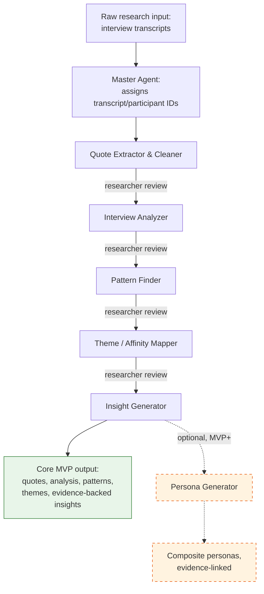

# ResearchMate — Capstone Project Plan

**Author:** Divyanshi Jain
**Program:** Flame Edu — Experience Design Capstone
**Document type:** Capstone plan (pre-build)
**Date:** September 11, 2026

---

## 1. Capstone Idea

ResearchMate is an AI-powered UX research assistant that turns messy, unstructured primary research — interview transcripts, survey responses, observation notes, and research notes — into clean, structured, evidence-backed UX research outputs: quotes, per-participant analysis, cross-participant patterns, themes, insights, and personas.

The system is built as a **Master Agent** that coordinates a set of **specialized Skills**, each responsible for one well-defined step of the qualitative research synthesis process. Rather than asking a single AI call to "make sense of these interviews," ResearchMate breaks synthesis into the same steps a human UX researcher would actually follow — extracting and cleaning quotes, analyzing individual interviews, comparing across participants, grouping into themes, and only then writing insights (and, later, personas) — with the researcher checking and approving the output at each step.

The core design bet is this: **AI is good at surfacing patterns across large amounts of qualitative text, but a human researcher must remain the final judge of what those patterns mean.** ResearchMate is built around that division of labor, not around replacing the researcher.

---

## 2. Problem Being Solved

UX research produces far more raw material than most teams can properly synthesize. A typical study with 6–10 interviews generates hours of transcripts, and turning that raw text into defensible insights, themes, and personas is slow, manual, and easy to do inconsistently — different researchers on the same transcripts can produce noticeably different themes.

Two problems compound this:

1. **Synthesis is labor-intensive.** Reading, coding, and cross-referencing transcripts by hand (sticky notes, spreadsheets, affinity walls) takes far longer than the interviews themselves, and is often the first thing cut under deadline pressure.
2. **Synthesis is hard to audit.** Once a team arrives at a persona or an insight statement, it is often difficult to trace it back to *which participants actually said what*. This makes stakeholders reasonably skeptical of research findings, and makes it hard for researchers to defend their own conclusions later.

ResearchMate addresses the first problem by using AI to do the heavy comparative reading across participants, and addresses the second by making every output traceable back to the specific quotes and participants that support it, by design — not as an afterthought.

---

## 3. Target Users

**Primary user:** Individual UX researchers or small research/design teams (e.g., a student, freelancer, or a 1–3 person research function inside a startup) who conduct qualitative research but do not have the time or headcount to do full manual synthesis on every project.

**Secondary user:** Design/product teams who receive research outputs (personas, insight decks, opportunity areas) and want confidence that those outputs are grounded in real participant data rather than a single researcher's impressions.

**What these users need from ResearchMate:**
- A fast first pass at synthesis that still respects their expertise and judgment.
- The ability to check any AI-generated claim against the original transcript in seconds.
- Outputs in the vocabulary UX researchers already use (pain points, needs, behaviors, motivations, themes, personas, HMWs) rather than generic AI summaries.

**What ResearchMate is *not* for:** fully automated research reporting with no human review, quantitative/statistical survey analysis, or transcription of raw audio/video (inputs are assumed to already be in text form).

---

## 4. Example Use Case

A UX researcher has conducted 6 interviews for a college library redesign project. They upload the interview transcripts into ResearchMate.

The system processes each participant's transcript separately, identifying pain points, needs, behaviors, and motivations. It then compares findings across all six participants to surface recurring patterns — for example, several students mentioning difficulty finding a quiet study space during exam weeks. Related patterns are grouped into themes (e.g., "Study environment and noise control"), and each theme is synthesized into an evidence-backed insight statement that cites exactly which participants and quotes support it.

At each stage — after quote extraction, after per-participant analysis, after pattern-finding, after theming, and after insight generation — the researcher reviews the output before the next Skill runs. They can accept a pattern as-is, rename a theme, or reject an insight that feels overstated. Only approved output moves forward to the next stage.

If the researcher wants to go a step further, they can also run the Persona Generator (an MVP+ addition, see Section 6) to produce 1–2 composite personas built from the already-validated themes and insights, with every persona trait still traceable back to specific participants and quotes.

This mirrors how a researcher would actually work through the same six transcripts by hand — just faster, and with every conclusion checkable against the original material.

---

## 5. Master Agent and Skills — How They Work Together

### 5.1 Architecture principle

ResearchMate is a **checkpointed pipeline**, not a single autonomous loop. The Master Agent calls Skills in a defined order, but pauses for researcher review between major stages rather than running end-to-end without oversight. Skills pass **structured data**, not free-form prose, to one another — every extracted quote, pattern, theme, insight, and persona trait carries an ID that links it back to its source. This shared "evidence schema" is what makes traceability possible; it is an architectural decision, not a separate feature bolted on later.

### 5.2 Human-in-the-loop checkpoint pattern

Every stage in the pipeline follows the same simple pattern:

**AI suggests → researcher reviews, edits, or rejects → the next stage only uses the approved output.**

Concretely: the Master Agent runs one Skill, shows the researcher its output, and waits. The researcher can accept it as-is, edit it (rename a theme, remove a weak pattern, reword an insight), or reject it and ask for it to be redone. Whatever the researcher approves — not the AI's raw first draft — is what the next Skill receives as input. This pattern is what lets ResearchMate use AI for real synthesis work (Section 9) while staying well short of an autonomous system: nothing moves to the next Skill, and nothing reaches the final report, without a human checkpoint in between.

### 5.3 Evidence & traceability model

Every unit of source material gets a stable ID as soon as it enters the system, and every downstream claim must reference the IDs it was built from:

```
Transcript (T1, participant P1)
  → Quote (P1-Q07)
    → Analysis item, e.g. Pain point (P1-PP02, cites [P1-Q07, P1-Q11])
      → Pattern (PAT03, cites [P1-PP02, P3-PP01, P4-PP04])
        → Theme (TH02, cites [PAT03, PAT07])
          → Insight (INS04, cites [TH02], participant_coverage: 4/6)
            → Persona trait (PERSONA-A.frustrations, cites [P1-Q07, P4-Q02, ...])  — MVP+
```

This means a researcher (or an instructor evaluating the capstone) can always trace "down" from an insight statement (or, later, a persona trait) to the exact original quotes it came from. No Skill is allowed to introduce a claim that cannot cite at least one upstream ID.

**"Why did ResearchMate say this?"** To keep this practical rather than a separate UI project, ResearchMate does not need a dedicated application to make evidence checkable. Every item in the combined report (Section 10) is written so a researcher can ask, for any pattern, theme, or insight: *"Why did ResearchMate say this?"* — and get a direct answer already sitting in the same report: the exact supporting quotes, which participants they came from, the pattern/theme they were grouped under, and the participant coverage. This is a formatting requirement on every Skill's output, not a new Skill or a new interface to build.

### 5.4 The Master Agent's job

- Ingests raw research material and assigns transcript/participant IDs.
- Calls Skills in sequence, passing each Skill's structured output as the next Skill's input.
- Enforces the evidence schema — rejects or flags any Skill output missing required citations.
- Surfaces each stage's output to the researcher for review/approval (or edit) before moving to the next stage (Section 5.2).
- Maintains the master traceability index so any output can be traced back to source at any time.
- Allows the researcher to re-run a later Skill if they edit an earlier stage (e.g., rename a theme and regenerate insights).

### 5.5 Skills — what each one receives and produces

| Skill | Receives | Does | Produces |
|---|---|---|---|
| **Quote Extractor & Cleaner** | Raw transcript or notes for one participant + participant ID | **Identify** candidate quote-worthy segments in the raw text → **select** the ones that best capture a distinct point → **lightly clean** each one (remove filler words/false starts only, without changing meaning or wording) → **preserve source**: keep the quote exactly as spoken, including keeping non-English quotes (e.g., Hindi) verbatim in the original script rather than translating them | List of extracted quotes, each with a unique quote ID, the original raw text, the cleaned text (in the original language where applicable), and context (e.g., which question it answered) |
| **Interview Analyzer** | Cleaned quotes + source transcript for one participant | Reads the participant's material and identifies candidate pain points, needs, behaviors, and motivations | Per-participant structured analysis; every item cites the quote ID(s) that support it |
| **Pattern Finder** | Interview Analyzer outputs for *all* participants | Compares pain points/needs/behaviors/motivations across participants to find recurring or semantically similar items (not just exact text matches) | List of patterns, each listing which participants/items support it and how many participants share it |
| **Theme / Affinity Mapper** | Patterns from Pattern Finder | Groups related patterns into higher-level themes, names and describes each theme | List of themes, each citing its constituent patterns and overall participant coverage |
| **Insight Generator** | Themes + underlying patterns + quotes | Synthesizes each theme into an evidence-backed insight statement, noted with participant coverage | List of insights, each citing supporting quote IDs and stating a participant-coverage / evidence-strength note (see Section 8, not a factual-confidence score) |
| **Persona Generator** *(MVP+ — see Section 6)* | Themes, insights, patterns, and quotes across all participants — only once these have been reviewed and approved by the researcher | Clusters participants by shared behaviors/needs/motivations into 1–3 archetypal (composite) personas | Persona profiles (goals, frustrations, behaviors, motivations), each trait citing the participant/quote IDs it was built from, explicitly labeled as a composite, not a real individual |

The core MVP pipeline is the first five Skills above (Quote Extractor & Cleaner → Insight Generator). Persona Generator is an MVP+ extension, built after the core pipeline is proven (Section 6).

### 5.6 Simple workflow diagram



Each arrow into the next Skill only fires after the researcher has reviewed (and optionally edited) the previous stage's output — the pipeline does not run start-to-finish unattended.

---

## 6. MVP Scope

The MVP is the smallest version of ResearchMate that demonstrates the full synthesis chain — from raw transcript to a defensible, evidence-backed insight — on a small set of sample interviews.

**Core MVP pipeline (five Skills, run in this order):**

1. Quote Extractor & Cleaner
2. Interview Analyzer
3. Pattern Finder
4. Theme / Affinity Mapper
5. Insight Generator

**MVP+ (the very next milestone after the core pipeline works):**
- **Persona Generator** — kept out of the core MVP and treated as a later milestone (Section 13), since it depends on themes and insights already being validated, and should not put the core five-Skill evidence chain at risk of being rushed.

**MVP also includes:**
- The evidence schema (stable IDs + citation requirement) running through all five core Skills — this is not optional or deferred, since it is what makes the outputs trustworthy.
- A checkpointed Master Agent that runs the Skills in order and pauses for researcher review between stages (Section 5.2).
- **Interview transcripts as the only MVP input type** (plain text, ideally with speaker labels). Survey responses, observation-note-specific parsing, and audio transcription are moved to future scope (Section 7) so the MVP stays focused on doing one input format well.
- A single, readable combined report (e.g., structured markdown or document) showing quotes → analysis → patterns → themes → insights with citations, so any output can answer "why did ResearchMate say this?" (Section 5.3).
- **No external APIs or integrations.** Everything runs on text the researcher provides directly (see Section 7 for possible future integrations).

**Explicitly out of MVP scope** (see Section 7): Persona Generator (MVP+), Research Map Generator, Opportunity Finder, Evidence Checker as a dedicated automated audit Skill, survey/observation-specific input handling, and any interactive/visual board-style output.

**Why this MVP and not a smaller one:** Cutting any one of the five core Skills would break the chain of evidence that is the whole point of the project. Generating insights directly from raw transcripts (skipping Pattern Finder and Theme Mapper) would be faster to build but would be indistinguishable from "ask AI to summarize interviews" — it would not demonstrate multi-step reasoning, cross-participant comparison, or theming, which are the core capstone requirements.

**Why this MVP and not a larger one:** Adding Persona Generator, Research Map Generator, or Opportunity Finder to the core MVP would either depend on insights already being validated (personas and HMWs are only as good as the insights under them) or introduce visual/interactive output that is a substantially different build problem — hard to do well inside Claude in the available time. All three are better attempted once the five-Skill core pipeline is proven, which is also why Persona Generator is kept as the very next milestone (MVP+) rather than pushed into distant future scope.

---

## 7. Final Goals / Future Scope

**Near-term (MVP+, immediately after the core pipeline is working):**
- **Persona Generator:** 1–3 composite personas built from already-approved themes and insights, with every trait traceable to evidence. Kept out of core MVP so the five-Skill evidence chain can be built and proven first (Section 6).

**Further out (final goals — only if time allows, or as a post-capstone version):**
- **Evidence Checker (dedicated Skill):** An automated audit pass that re-reads every insight and persona claim against the original source quotes and flags anything unsupported, overstated, or drifted from the source wording. In the MVP, traceability is enforced structurally (every claim must cite an ID); the Evidence Checker would add an *active, automated* verification step on top of that — a strong "final goal" because it directly strengthens the anti-hallucination story.
- **Opportunity Finder:** Generates "How Might We" statements and candidate opportunity areas from validated insights. Deferred because it should only run on insights the researcher has already reviewed and trusts, so it depends on the MVP working well first.
- **Research Map Generator:** Produces affinity maps, empathy maps, and journey maps as visual, explorable artifacts. Deferred because good visual/interactive maps are a substantial UI project on their own, separate from the qualitative-reasoning core of ResearchMate.
- **Additional input types:** survey responses (open-ended text), observation notes, and other qualitative formats beyond interview transcripts.
- **Multi-project / longitudinal comparison:** comparing themes and personas across separate research studies over time.
- **Evidence Strength scoring:** a numeric or tiered indicator per insight, based on participant coverage and consistency, beyond the simple coverage note in the MVP. This would remain a structured signal of *how much evidence supports a claim* — not a statistical or factual measure of whether the claim is "true," which an LLM cannot responsibly calculate.

**External APIs / Integrations (future only — not MVP dependencies):**

The MVP requires no external APIs or integrations. Possible future integrations, none of which the MVP depends on:
- **Google Drive** — for importing research files directly instead of manual upload
- **Figma or Miro** — for exporting research maps as visual, editable boards
- **Notion** — for storing and sharing finished research outputs
- **A speech-to-text API** — for transcribing raw audio interviews before they enter the pipeline

These are listed to show a natural growth path, not because any of them are needed to demonstrate the core capstone idea.

---

## 8. AI-Involvement Level

**Classification: High** (on a Low / Medium / High / Very High scale).

Definitions used for this scale:

- **Low:** AI performs surface-level formatting or summarization of a single document; no interpretation or comparison.
- **Medium:** AI assists with one well-defined subtask at a time (e.g., cleaning a single transcript) but does not compare across sources, find patterns, or synthesize findings.
- **High:** AI extracts and classifies research evidence, compares findings across multiple participants, finds semantic patterns, clusters them into themes, and synthesizes candidate insights (and, in MVP+, composite personas) — but every output remains traceable to evidence, and a human reviews, edits, accepts, or rejects each stage before it is treated as final.
- **Very High:** AI autonomously synthesizes and finalizes research conclusions with no required human checkpoint, and may act on or publish those conclusions independently.

ResearchMate sits at **High** — not Medium, and not Very High.

---

## 9. Why This Level of AI Involvement Makes Sense

ResearchMate's AI does real synthesis work, not just formatting or summarization. Across the pipeline, it:

- extracts and classifies research evidence (pain points, needs, behaviors, motivations) from raw transcripts,
- compares findings across multiple participants rather than reading one transcript in isolation,
- finds semantic patterns — recurring ideas expressed in different words, not just repeated phrases,
- clusters those patterns into themes,
- synthesizes candidate insight statements from each theme, and
- can generate composite personas (MVP+) from validated themes and insights.

This is why "High" rather than "Medium" is the right classification: a Medium system would handle one transcript, or one subtask, at a time and stop there, without ever comparing across participants or grouping findings into themes.

At the same time, three things keep it below "Very High":

1. **Every stage is checkpointed.** AI suggests, the researcher reviews, edits, or rejects, and only the approved output moves on to the next Skill (Section 5.2) — the Master Agent never runs Quote Extractor & Cleaner through Insight Generator (or Persona Generator) in one unattended pass.
2. **Every claim is traceable, by construction.** Because the evidence schema requires citations at every step, nothing in the final output can be "invented" without it being visibly ungrounded (no citation IDs) to a reviewer.
3. **Final judgment stays with the researcher.** Themes, insights, and personas are treated as *drafts for review*, not as findings ready to hand to stakeholders. The researcher decides what is real, what needs rewording, and what should be discarded.

This matches how qualitative UX research actually works in practice: a senior researcher will happily use a junior researcher's or tool's first-pass coding and clustering, but will not sign off on a persona or insight report without checking it against the transcripts themselves. ResearchMate is designed to be that junior-researcher-style collaborator, not an autonomous decision-maker — which is also the appropriate level of trust to place in an LLM-based system doing qualitative synthesis, given the real risk of subtly plausible-sounding but ungrounded claims.

---

## 10. Expected Inputs and Outputs

**Inputs (MVP):**
- Interview transcripts (plain text, ideally with speaker labels) — the only input type the MVP is built and tested against.
- A participant list or count, so the Master Agent can assign participant IDs.

**Inputs (future scope, not MVP):** survey responses, observation notes, and other qualitative formats (Section 7).

**Outputs (core MVP), all cross-linked via the evidence schema:**
- Extracted, verbatim-respecting participant quotes (with IDs)
- Per-participant analysis: pain points, needs, behaviors, motivations
- Cross-participant patterns, with participant coverage
- Named, described themes/affinity groups
- Evidence-backed insight statements, each with a participant-coverage / evidence-strength note
- A single combined report (structured markdown/document) showing the full chain from raw quote to final insight, so any output can answer "why did ResearchMate say this?"

**Outputs (MVP+):**
- 1–3 research-backed composite personas, with every trait tied to supporting evidence

---

## 11. Success Criteria

The capstone build will be considered successful if:

1. Given 3–6 sample interview transcripts, the pipeline produces extracted/cleaned quotes, per-participant analysis, cross-participant patterns, themes, and evidence-backed insights, end to end. (If the Persona Generator, MVP+, is also built, it produces at least one composite persona from the same data.)
2. Every insight statement (and, if built, every persona trait) can be traced, via IDs, back to at least one specific quote and participant — and a reviewer can verify this by hand in under a minute per claim.
3. No quote appears anywhere in the output that is not a verbatim or lightly-cleaned excerpt of something a participant actually said in the source material (spot-checked against the original transcripts).
4. The Master Agent's staged, checkpointed structure is visibly demonstrable — i.e., the capstone presentation can show each Skill's output separately, not just a final combined report, proving this is a coordinated multi-agent system rather than one large prompt.
5. If a researcher edits an intermediate output (e.g., renames a theme, removes a pattern), later stages can be re-run and remain consistent with the edit.

---

## 12. Risks, Limitations, and Assumptions

**Risks:**
- *Small sample sizes.* A classroom-scale study (e.g., 3–6 participants) may produce patterns that reflect coincidence rather than true saturation. Mitigation: every pattern/insight explicitly states participant coverage, so low-coverage claims are visibly weaker rather than presented as equally strong.
- *Quote drift.* An AI model asked to "clean" a quote could unintentionally paraphrase it into something the participant didn't actually say. Mitigation: Quote Extractor & Cleaner is constrained to remove filler/false starts only, and cleaned quotes remain checkable against the stored raw text.
- *Translation drift.* If a participant speaks in a language other than English (e.g., Hindi), auto-translating their quote risks subtly changing its meaning or tone. Mitigation: non-English quotes are kept verbatim in the original language and script, in quotation marks, rather than translated — any translation for reporting purposes is a separate, clearly-labeled step the researcher does deliberately, not something a Skill does silently.
- *Persona stereotyping (MVP+).* Personas built from thin or overlapping evidence risk becoming generic archetypes rather than reflections of real participants. Mitigation: persona traits require a minimum evidence count and are explicitly labeled as composites, not individuals; this risk only applies once Persona Generator is built.
- *Context/length limits.* Processing several full transcripts at once could exceed practical context limits. Mitigation: the pipeline is already per-participant-then-aggregate (a map-reduce style flow), which keeps each Skill's individual workload small.
- *Scope creep.* Visual, interactive outputs (affinity boards, journey maps), extra input formats, and external integrations are all appealing but are substantially different build problems from qualitative-text synthesis. Mitigation: all explicitly deferred to future scope (Section 7).

**Privacy:**
Participant data is sensitive by nature. Before transcripts are uploaded, the researcher is responsible for removing or replacing directly identifying details (full names, contact information, student/employee IDs) with participant labels (e.g., "P1"). ResearchMate does not collect any personal data beyond what appears inside the uploaded text, and does not require names, emails, or other identifiers to function — participant IDs alone are sufficient for every Skill in the pipeline.

**Limitations:**
- ResearchMate augments, and does not replace, a researcher's judgment; no output is meant to be shared with stakeholders without human review.
- The system does not perform statistical analysis of quantitative survey data.
- The system does not transcribe audio or video; inputs must already be in text form.

**Assumptions:**
- Input materials are already de-identified/anonymized by the researcher before being provided to the system, per the Privacy note above.
- Skills are implemented as Claude Skills invoked by a Master Agent/orchestrator within the Claude environment, not as separate standalone services.
- The researcher is available to review and approve each pipeline stage; ResearchMate is not designed to run fully unattended.

---

## 13. Development Sequence

**Milestone 0 — Foundations**
Define the evidence schema (ID formats for transcripts, participants, quotes, patterns, themes, insights, and the citation rules between them). Assemble 2–3 sample interview transcripts to use as running test fixtures throughout the build.

**Milestone 1 — First build milestone: prove the traceability approach**
Build Quote Extractor & Cleaner and Interview Analyzer end to end on a *single* sample transcript. Manually verify that every quote is checkable against the source and every analysis item cites real quote IDs. This is the smallest slice that proves the core mechanism works before adding cross-participant complexity — intentionally kept small so the traceability model is validated early.

**Milestone 2 — Cross-participant comparison**
Add 2–3 more participant transcripts. Build Pattern Finder to compare Interview Analyzer outputs across all participants.

**Milestone 3 — Theming**
Build Theme / Affinity Mapper on top of the patterns from Milestone 2.

**Milestone 4 — Insight synthesis**
Build Insight Generator, including participant-coverage / evidence-strength notes on each insight.

**Milestone 5 — Master Agent orchestration and reporting (core MVP complete)**
Wire the Master Agent to run the five core Skills in sequence with review checkpoints between stages, and produce the single combined, cross-linked report described in Section 10. This is the point at which the core MVP is functionally complete and demonstrable on its own.

**Milestone 6 — Persona Generator (MVP+)**
Build Persona Generator on top of the validated themes and insights from Milestones 3–5, producing 1–3 evidence-linked composite personas. Attempted only once Milestone 5 is solid.

**Milestone 7 — Stretch (only if time remains)**
A first, minimal version of the Evidence Checker (automated re-verification pass) and/or a simple static (non-interactive) rendering of one research map as a proof of concept for future scope — attempted only after Milestones 1–6 are solid, and dropped without penalty if time runs short.

---

*End of plan.*
 i