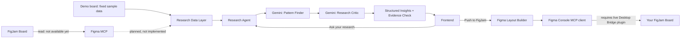

# FigJam Research Agent (experimental branch: `figmaconnecttry`)

## 1. What was built

An experimental extension of the standalone ResearchMate webapp (`webapp/`)
that connects a FigJam research board to a Gemini-backed research agent:
retrieve, normalize, analyze (Gemini), critique (a second Gemini pass), and
present structured, evidence-linked results in a new frontend page, with a
follow-up question and answer interface grounded in the same board.

This is scoped as an MVP proof of the pipeline shape, not a production
integration. It reuses the existing project's architecture (Flask backend,
pluggable `llm_providers.py`, plain HTML/CSS/JS frontend) rather than
introducing a new stack.

## 2. Honesty about the MCP integration: what actually works

**No live Figma/FigJam MCP tool is available in this environment.** Before
writing any code, the available tool catalog was searched for Figma/FigJam
tooling. The only related entry found was an unauthenticated `claude.ai
Figma` connector, listed as requiring OAuth before any of its tools become
visible. No callable tool (authorized or not) exists to read FigJam board
content (sticky notes, sections, groups) in this session.

Because this session is non-interactive, the OAuth flow for that connector
cannot be run here even if it were the right tool for the job. It's also not
confirmed that connector exposes FigJam-specific node content (sticky
notes, sections) versus general Figma design-file access, since its tool
schema was never loaded.

**What this means concretely:**
- `figjam/adapter.py` defines a real `FigJamAdapter` interface and a
  `MCPFigJamAdapter` implementation. `MCPFigJamAdapter.is_available()`
  returns `False`, and calling `fetch_board()` raises a `FigJamUnavailableError`
  with the explanation above; it is a real, empty-handed interface, not a
  fake success path.
- A `DemoFigJamAdapter` provides a fixed sample research board (15 items
  across 3 sections: Study Space, Wayfinding, Booking & Group Rooms) so the
  rest of the pipeline, retrieval through normalization, Gemini analysis,
  the critic pass, evidence verification, and the frontend, can be
  exercised end to end. Every place demo data surfaces in the UI is labeled
  as demo data (the connect banner, the board name itself).
- `get_adapter()` in `adapter.py` is the single place to swap in a real MCP
  tool later: once one is authorized and exposed, implement its call inside
  `MCPFigJamAdapter.fetch_board()`, mapping its response into the same
  `{"board_name": str, "raw_items": [...]}` shape `DemoFigJamAdapter`
  already produces, and `get_adapter()` will prefer it automatically
  (it checks `mcp_adapter.is_available()` first).

**Gemini reasoning is real, not simulated.** The two-stage Gemini pipeline
(Pattern Finder, then Research Critic) is fully implemented against the
project's existing pluggable `llm_providers.py` (Anthropic / OpenAI / Gemini
/ offline mock). It was verified with a real Gemini API call during this
build (see "What was tested" below) before the free-tier daily quota ran out
from testing. It is the FigJam *board retrieval* that is simulated via demo
data, not the AI reasoning on top of it.

## 3. Architecture



Code = deterministic data operations: retrieving raw items, normalizing them
into typed `ResearchItem`s, counting, grouping by section, and verifying
that every evidence ID Gemini cites actually exists in the retrieved board
(if not, the claim is dropped down to "unsupported" in code, not trusted
from the model).

Gemini = reasoning only: synthesizing themes/insights/contradictions/gaps/
opportunities (Pattern Finder), then challenging those insights for
evidence strength, overgeneralization, and contradictions (Research
Critic), and answering researcher questions grounded in the board.

## 4. Files added

```
webapp/backend/figjam/
  __init__.py
  models.py           ResearchItem, FigJamResearchContext (dataclasses)
  adapter.py           FigJamAdapter interface, MCPFigJamAdapter (unavailable),
                        DemoFigJamAdapter (sample board), get_adapter()
  normalize.py          raw board -> FigJamResearchContext (deterministic)
  research_agent.py     connect_board(), analyze_research(), ask_question()
                        (Gemini calls + evidence verification + activity log)
  figma_mcp_client.py    real MCP client for Figma Console MCP (write path):
                        create_section(), create_stickies(), list_tools(),
                        wait_for_bridge() (polls for the plugin to reconnect)
  figma_layout.py        deterministic analysis-output -> FigJam layout plan,
                        push_layout_to_figjam()
webapp/backend/test_figjam.py   standalone checks, run with `python test_figjam.py`
webapp/frontend/figjam.html     Connect FigJam / Agent Activity / Overview /
                                 Results / Ask your research page
webapp/frontend/figjam.css      page-specific styles (verdict badges, activity
                                 checklist, ask transcript)
webapp/frontend/figjam.js       wires the above to the API endpoints below
webapp/figma-plugin/            Desktop Bridge plugin (manifest.json, code.js,
                                 ui.html), vendored from figma-console-mcp
                                 1.40.0 so it can be imported straight from
                                 this repo (see section 7)
webapp/backend/Procfile         Railway/Heroku-style process declaration
webapp/backend/nixpacks.toml    tells Railway's builder to include Node.js
                                 alongside Python (see section 8)
```

Modified: `webapp/backend/app.py` (new routes below), `webapp/backend/llm_providers.py`
(MockProvider now branches by system-prompt marker so FigJam gets its own
canned demo response instead of the Pattern Analyzer's), `webapp/frontend/index.html`
(one added nav link to `/figjam`, no other changes to the existing page),
`webapp/backend/requirements.txt` and `webapp/.env.example` (added `mcp`,
`httpx`, `waitress`, `FIGMA_ACCESS_TOKEN`, `FIGJAM_MCP_MODE` for the Push to
FigJam feature and its two transport modes), `webapp/frontend/figjam.html` /
`figjam.js` (added the Push to FigJam button and the Cloud Mode pairing UI).

## 5. New backend routes

- `GET /figjam`: serves the new frontend page.
- `POST /api/figjam/connect`: retrieves + normalizes the (demo) board, stores
  it in-memory for the session, returns overview counts, the activity log,
  and `is_demo: true`.
- `POST /api/figjam/analyze`: runs Pattern Finder then Research Critic on the
  connected board, verifies every cited evidence ID actually exists in the
  board, returns themes/insights/contradictions/research_gaps/design_opportunities
  plus the running activity log. Requires a prior `/connect` call (400 if not).
- `POST /api/figjam/ask` `{ "question": "..." }`: answers grounded only in the
  connected board and prior findings; marks `grounded: false` if it can't
  find support rather than guessing. Requires a prior `/connect` call.
- `GET /api/figjam/mode`: returns `{"mode": "local"|"cloud"}` (from
  `FIGJAM_MCP_MODE`), so the frontend only shows the pairing UI when relevant.
- `POST /api/figjam/pair`: cloud mode only, generates a one-time pairing code
  via `figma_pair_plugin` for the Desktop Bridge plugin's Cloud Mode toggle.
- `POST /api/figjam/push-to-figjam`: pushes the current analysis to a real
  FigJam board as sections + sticky notes via Figma Console MCP (section 7).
  Requires a prior `/analyze` call (400 if not), and Figma Desktop + the
  Desktop Bridge plugin connected, local or paired via cloud (502 with a
  clear message if not reachable).

State is in-memory, single-session, matching the existing Pattern Analyzer
page's approach (no database introduced for this MVP).

## 6. How Gemini is used

Two distinct system prompts, both going through the existing
`llm_providers.get_provider()` abstraction (so this works with Anthropic or
OpenAI too, not only Gemini, by changing `LLM_PROVIDER` in `.env`):

1. **Pattern Finder** (`ANALYZE_SYSTEM_PROMPT` in `research_agent.py`): given
   every research item with its stable id, produce themes, insights,
   contradictions, research gaps, and design opportunities, each citing the
   exact item ids it's based on.
2. **Research Critic** (`CRITIC_SYSTEM_PROMPT`): given the same items plus the
   candidate insights, independently judges each insight as `validated`,
   `weak`, or `contradictory`, with a specific note.

After both calls, application code (`_verify_evidence`) drops any cited id
that doesn't actually exist in the retrieved board and marks that claim
`unsupported: true` (surfaced in the UI as "Unsupported / needs
verification"), so Gemini cannot silently invent evidence.

## 7. Writing output back to FigJam ("Push to FigJam")

This is a separate capability from board *reading* (section 2 above), added
after research corrected an earlier assumption in this document: a
write-capable Figma MCP integration for FigJam does exist today, via a
community project called **Figma Console MCP**
(https://github.com/southleft/figma-console-mcp), which exposes tools
including `figjam_create_section`, `figjam_create_sticky`,
`figjam_create_stickies` (batch, up to 200), `figjam_auto_arrange`, and more.
(Figma's own *official* remote MCP server at `mcp.figma.com` also exists, but
only allowlists specific IDE clients like Claude Code/Cursor/VS Code; a
custom backend cannot connect to it without joining Figma's developer
waitlist, so it isn't used here.)

**The hard constraint that can't be worked around:** Figma Console MCP does
not write to FigJam headlessly via just an API token. It relays tool calls to
a "Desktop Bridge" plugin that must be running *live* inside the Figma
Desktop app, with the target FigJam board open, *somewhere*. This is a real
limitation of Figma's plugin sandboxing model, not a shortcut taken in this
build. What changed after further work (section 7.1 below): that "somewhere"
doesn't have to be the same machine as the backend server anymore, so this
now works with the backend hosted remotely (Railway) as long as the plugin
stays open on any machine, not necessarily Railway's own.

### What was built

- `webapp/backend/figjam/figma_mcp_client.py`: a real MCP stdio client (using
  the official `mcp` Python SDK) that spawns `npx -y figma-console-mcp@1.40.0`
  (version-pinned, see below) as a subprocess and calls its tools:
  `create_section`, `create_stickies`, `list_tools` (a connectivity check that
  doesn't require the bridge). One `session()` is now shared across an entire
  push operation rather than reopened per tool call, so a connected plugin
  stays paired with the same server instance for the whole push instead of
  reconnecting after every single sticky/section.
- `webapp/figma-plugin/` (`manifest.json`, `code.js`, `ui.html`): the Desktop
  Bridge plugin, checked into the repo (copied from a running `1.40.0`
  server's auto-generated files) so it can be imported into Figma Desktop
  directly from a repo-relative path instead of a hidden per-machine folder.
  Pinned to the same `1.40.0` version as the server on purpose: using
  `@latest` for the server while the plugin is a frozen copy would risk them
  silently drifting apart over time. If the plugin is ever re-copied from a
  newer server run, bump `_SERVER_PACKAGE` in `figma_mcp_client.py` to match.
- `webapp/backend/figjam/figma_layout.py`: deterministic (non-LLM) layout
  logic that turns the FigJam agent's analysis output into one real FigJam
  **section** per group (Themes, Insights, Contradictions, Research Gaps,
  Design Opportunities), each containing a grid of real sticky notes colored
  by group, positioned with simple column/row math.
- `POST /api/figjam/push-to-figjam` in `app.py`: runs the layout against
  whatever analysis is currently in memory, returns a summary (sections
  created, sticky count) or a clear error if the board/bridge isn't reachable.
- A **Push to FigJam** button on the results page, with the setup
  requirements stated directly in the UI, not hidden in docs only.

### Setup required (all on your machine, none of this can be automated remotely)

1. Install Node.js (required so the backend can run `npx`).
2. Get a Figma personal access token (Settings > Security > Personal access
   tokens), starts with `figd_`. Set `FIGMA_ACCESS_TOKEN=figd_...` in the repo
   root `.env`.
3. Open Figma Desktop, open the target FigJam board.
4. **Plugins > Development > Import plugin from manifest...**, select
   `webapp/figma-plugin/manifest.json` from this repo (one-time import; skip
   if already imported).
5. **Plugins > Development > Figma Desktop Bridge**, launch it. It connects
   automatically; no extra config.
6. Click **Push to FigJam** in the webapp while all of the above stays open.

### What was actually tested (and what wasn't)

- **Tested and confirmed working:** the MCP client genuinely spawns
  `figma-console-mcp`, completes the real MCP `initialize` handshake, and
  lists all 121 real tools it registers, including `figjam_create_section`
  and `figjam_create_stickies` (confirmed live, not from documentation alone;
  the docs actually undersold this - they didn't mention
  `figjam_create_section` existed at all, its exact JSON schema was pulled
  directly from the running server instead of trusted from docs).
- **Tested and confirmed working:** the full HTTP path, `POST
  /api/figjam/push-to-figjam` with a populated (mock-provider) analysis in
  memory, correctly builds a layout, attempts the real tool calls, and (since
  no Figma Desktop/Bridge was available in this environment to test against)
  fails with a clear, specific error rather than crashing, hanging, or
  silently "succeeding" with nothing created.
- **Confirmed working live, on a real FigJam board, with the user driving the
  Figma Desktop side:** with the plugin imported from `webapp/figma-plugin/`
  and launched, a full `POST /api/figjam/push-to-figjam` call created all 5
  real sections (Themes, Insights, Contradictions, Research Gaps, Design
  Opportunities) and 8 real sticky notes on an actual board, end to end,
  through the deployed Flask route, not just the underlying function.
- **Bug found and fixed during this live test:** every push spawns a brand
  new `figma-console-mcp` server process (see `session()`'s docstring), so
  even an already-launched plugin needs several seconds to notice the new
  instance and reconnect its WebSocket. The first live attempts failed with
  "Cannot connect to Figma Desktop" even though the plugin was genuinely
  running, purely due to this reconnect delay - confirmed by manually holding
  a session open for 20 seconds, which let the exact same write succeed right
  after it had just failed instantly. Fixed properly with
  `wait_for_bridge()`, which polls the server's own `figma_get_status(probe=
  true)` tool until it reports a working roundtrip (up to a 30s timeout),
  instead of guessing a fixed sleep. Also fixed a real bug in error handling:
  anyio wraps exceptions raised during tool calls in nested
  `BaseExceptionGroup`s by the time they propagate out of the session context
  manager, which was silently replacing specific tool error messages (like
  the actual "Cannot connect to Figma Desktop" reason) with a generic
  fallback; `_find_figma_error()` now unwraps nesting to recover the real
  message.

### Known simplification

`figma_layout.py` positions stickies with fixed column/row math rather than
calling `figjam_auto_arrange`, because the batch `figjam_create_stickies`
tool's return value (whether it includes per-sticky node ids usable by
`auto_arrange`) wasn't confirmed live. The manual grid math achieves the same
visual result without depending on an unverified return shape.

## 7.1 Cloud Mode (for hosting the backend remotely, e.g. Railway)

Local Mode (above) spawns the MCP server as a local subprocess that opens a
`ws://localhost:9223` server. The Desktop Bridge plugin connects to that
localhost address, which only works when the plugin and the backend are on
the *same machine*. Once the backend is hosted on Railway, "localhost" from
the plugin's point of view is the plugin's own machine, never Railway's
container, so Local Mode cannot work there at all.

**Cloud Mode fixes this** by connecting over HTTPS to Figma Console MCP's own
hosted relay instead of spawning anything locally. Set `FIGJAM_MCP_MODE=cloud`
(env var, e.g. a Railway service variable) and the client
(`figma_mcp_client.py`) switches from spawning `npx` to connecting to
`https://figma-console-mcp.southleft.com/mcp` with `FIGMA_ACCESS_TOKEN` as a
Bearer token. This is the community project's *own* relay service, a
different thing from Figma's official remote MCP server (`mcp.figma.com`),
which was tested and ruled out separately - see "What was verified" below.

**Pairing, once, not repeatedly:** the plugin still needs to be told which
cloud relay session to join, via a one-time 6-character code:

1. `POST /api/figjam/pair` (or the **Generate pairing code** button, shown
   automatically when `FIGJAM_MCP_MODE=cloud`) calls the `figma_pair_plugin`
   tool and returns a code, valid for 5 minutes *to redeem*.
2. In the same Desktop Bridge plugin already imported from
   `webapp/figma-plugin/`, toggle **Cloud Mode** and enter the code.
3. Once connected, pairing persists - confirmed live (see below), it is a
   one-time setup, not a recurring 5-minute cycle. (An earlier version of
   this document assumed otherwise, based on an AI-summarized reading of the
   vendor's docs; that assumption was wrong and has been corrected here after
   testing the real behavior directly.)

**What was verified, live, for Cloud Mode specifically:**
- Confirmed Figma's *official* remote MCP server cannot be used here at all:
  a raw MCP `initialize` POST to `https://mcp.figma.com/mcp` returned `401`
  with a standard OAuth challenge, and a Dynamic Client Registration attempt
  against its own `https://api.figma.com/v1/oauth/mcp/register` endpoint
  returned `403 Forbidden` - this is Figma's own infrastructure rejecting any
  non-allowlisted client outright, not a bug in our code.
- Connected directly to the community relay (`figma-console-mcp.southleft.com/mcp`)
  with a plain Figma personal access token as Bearer auth - this succeeded
  (95 tools listed), confirming this relay's own auth model is separate from
  and more open than Figma's official server's.
- Generated a real pairing code via `figma_pair_plugin`, paired the actual
  Desktop Bridge plugin (Cloud Mode toggle) to it, and created a real section
  on the user's live board through the cloud relay, immediately, with no
  wait needed (unlike Local Mode's `wait_for_bridge` delay).
- Waited ~90 seconds and wrote again with no re-pairing, no new code - the
  same pairing was still live, confirming persistence rather than a 5-minute
  connection cycle.
- Ran a full push (5 sections, 8 stickies) through the actual
  `POST /api/figjam/push-to-figjam` Flask route with `FIGJAM_MCP_MODE=cloud`
  set - succeeded end to end, with no `localhost` involved anywhere.
- Found and fixed a real bug during this: `figma_get_status` (used by
  `wait_for_bridge` to poll for a Local Mode reconnect) is not a registered
  tool on the cloud relay at all (95 tools there vs 121 on the local server),
  so calling it there just failed outright. Fixed by making
  `wait_for_bridge()` a no-op in cloud mode - the persistent relay doesn't
  need a reconnect-delay workaround the way a freshly-spawned local process
  does.
- Also observed the pairing disconnect once during testing (most likely from
  repeatedly toggling the plugin between Local and Cloud mode during this
  same session) - the system correctly returned a clear "No plugin connected
  to cloud relay" error rather than hanging or failing silently, and
  re-pairing with a freshly generated code is all that's needed to recover.

## 8. Deploying to Railway

**Not deployed or tested against real Railway infrastructure in this
session** - no Railway CLI or account access was available here. Everything
below was prepared and verified as far as possible without that (Procfile
command tested locally with `waitress-serve`; the Cloud Mode MCP path tested
live per section 7.1), but the actual "create a Railway project, connect
this repo, deploy" steps need to happen on your end.

### Files added for deployment
- `webapp/backend/Procfile`: `web: waitress-serve --host=0.0.0.0 --port=$PORT app:app`.
  Uses `waitress` instead of `gunicorn` specifically so it could be tested on
  this Windows dev machine too (`gunicorn` needs `fcntl`, Unix-only);
  `waitress` runs identically on both and is a legitimate production WSGI
  server, not a dev-only choice.
- `webapp/backend/nixpacks.toml`: tells Railway's Nixpacks builder to include
  Node.js alongside Python, since `figma_mcp_client.py`'s Local Mode spawns
  `npx`. Without this, Nixpacks would likely auto-detect only Python and
  Local Mode would fail on Railway with "npx not found" (Cloud Mode wouldn't
  need Node.js at all, but Local Mode is still the default unless
  `FIGJAM_MCP_MODE=cloud` is set).

### Setup steps (to do in Railway's dashboard)
1. Create a new Railway project, connect this GitHub repo.
2. In the service's Settings, set **Root Directory** to `webapp/backend` -
   this is a monorepo with unrelated files at the repo root (`.claude/`,
   other branches' work), so Railway needs to know where the actual app
   lives to find `Procfile`, `nixpacks.toml`, and `requirements.txt`.
3. Set these environment variables under the service's Variables tab (do
   NOT commit a `.env` file with real secrets - `.env` is already gitignored):
   - `LLM_PROVIDER` (`gemini`/`anthropic`/`openai`/`mock`) and whichever
     matching `*_API_KEY` / `*_MODEL` it needs.
   - `FIGMA_ACCESS_TOKEN` and `FIGJAM_MCP_MODE=cloud` if you want Push to
     FigJam to work on the deployed version (see section 7.1 - Local Mode,
     the default, cannot work once the backend isn't on your machine).
4. Deploy. Railway sets `$PORT` automatically; the Procfile already uses it.

### What this means for "Push to FigJam" once deployed
With `FIGJAM_MCP_MODE=cloud` set, the deployed app's **Generate pairing
code** button (shown automatically in that mode) lets you pair your own,
locally-running Figma Desktop + plugin to the relay once. After that,
clicking **Push to FigJam** on the *publicly hosted* site writes to your
board through the cloud relay, with nothing related to FigJam running on
Railway itself except the outbound HTTPS calls in `figma_mcp_client.py`.

## 9. How to run it

```bash
cd webapp/backend
pip install -r requirements.txt   # google-generativeai already included
python app.py
```

Open `http://localhost:5000/figjam`. Click **Connect / Select FigJam**
(connects the demo board, since no MCP source is available), then
**Analyze with Gemini**. Ask follow-up questions in **Ask your research**
once analysis has run.

Configure the LLM provider via the repo root `.env` (`LLM_PROVIDER=gemini|
anthropic|openai|mock`), same as the rest of the webapp.

To also use **Push to FigJam** (section 7): install Node.js, set
`FIGMA_ACCESS_TOKEN` in `.env`, and have Figma Desktop open with the target
board and the Desktop Bridge plugin running before clicking the button.

## 10. What was tested

- `python webapp/backend/test_figjam.py`: 7 checks, all passing. Covers
  normalization of a typical board, an unsupported FigJam node type falling
  back to `"unknown"` instead of crashing, an empty board being rejected,
  the demo adapter connecting successfully, `MCPFigJamAdapter` failing
  honestly with a clear message, malformed/fenced JSON parsing, and evidence
  verification dropping invented ids.
- Ran the pipeline directly against a live Gemini call (bypassing Flask) during
  this build: connect succeeded; the analyze call hit a real `429
  ResourceExhausted` (free-tier daily quota of 20 requests, already spent on
  earlier testing in this session) and surfaced a clean, specific error
  instead of hanging or crashing.
- Ran the full HTTP pipeline (`/api/figjam/connect` -> `/api/figjam/analyze`
  -> `/api/figjam/ask`) against the offline mock provider, with real evidence
  ids from the demo board, correct verdict merging, and a grounded answer
  citing real item ids.
- Verified the empty-question validation path (`{"question": ""}` -> 400).
- Verified `GET /figjam`, `GET /api/provider` after the change.
- Push to FigJam: see section 7's "What was actually tested" subsection for
  the write-path-specific tests (live MCP handshake, real tool list, full
  HTTP route, and the honest limitation on what couldn't be verified here).

## 11. What currently works

- Retrieve (demo data) -> normalize -> analyze -> critique -> evidence
  verification -> structured frontend display -> grounded Q&A, end to end.
- Evidence is real and traceable: every displayed theme/insight/contradiction
  shows the exact demo-board item ids backing it, and unsupported claims are
  labeled rather than hidden.
- Agent Activity panel reflects real pipeline steps (not animated placeholders):
  it's built from the same `activity` list the backend actually appended to
  during the request.
- Approve / Edit / Challenge / Reject controls on insights (frontend-only
  state, per the task's guidance that this can stay local for now).

## 12. What does not work / limitations

- **No real FigJam board can be connected.** Every "Connect FigJam" click
  loads the same fixed demo board. This is the single biggest gap and is
  documented, not hidden, in the UI banner and the connect response
  (`is_demo: true`).
- The Gemini free-tier API key used during this build hit its daily request
  quota (20/day) partway through testing, so live (non-mock) verification of
  `/api/figjam/analyze` and `/api/figjam/ask` end-to-end over HTTP could not
  be completed in this session; it was verified with a real Gemini call
  directly against the pipeline function (see above) before the quota ran
  out, and separately verified fully over HTTP with the mock provider.
- No automated test hits the actual Flask routes (only the underlying
  pipeline functions are unit-tested); route-level testing was done manually
  via HTTP calls during the session instead of as a checked-in test.
- `google-generativeai` (used by the existing `GeminiProvider`) is marked
  deprecated upstream in favor of `google-genai`; not migrated here since
  it's shared with the already-working Pattern Analyzer page and migrating
  it was out of scope for this experimental branch.
- ~~"Push to FigJam" cannot be verified end-to-end from this build
  environment~~ **Resolved:** verified live with the user driving the Figma
  Desktop/plugin side (section 7). A real push (5 sections, 8 stickies)
  succeeded through the actual deployed Flask route on a real FigJam board.
- **Local Mode pushes still take ~5-30 seconds** even when everything is
  already running, because `wait_for_bridge()` has to wait for the plugin to
  reconnect to the freshly-spawned local server before any write can succeed
  (see section 7). This is inherent to how the local server works (a new
  process per session, not a long-lived daemon), not something fixable in
  our own code without changing that server's architecture. **Cloud Mode
  (section 7.1) does not have this delay** - confirmed live, writes succeed
  immediately, since the relay is already persistently connected from
  pairing rather than freshly spawned per push.
- **Cloud Mode's pairing was observed to disconnect once** during this
  session's testing (most likely from switching the plugin between Local and
  Cloud mode repeatedly while testing both). Re-pairing via a fresh code
  (the **Generate pairing code** button) resolves it; there is no way to
  detect a stale pairing in advance short of attempting a write and getting
  the clear "No plugin connected to cloud relay" error back.
- **Railway deployment itself is untested** (no Railway account/CLI access
  in this build environment). The `Procfile` command was verified locally
  with `waitress-serve`, and Cloud Mode's HTTPS-only transport was verified
  live end-to-end, but the actual Nixpacks build and Railway runtime have not
  been exercised. See section 8.
- **Auto-arrange isn't used**, so sticky layout inside each section is fixed
  grid math rather than Figma's own layout tool; see the "Known
  simplification" note in section 7.
- No "section" grouping tool call was previously known to exist; this
  document originally (incorrectly) stated FigJam had no section-creation
  tool at all, based on incomplete third-party docs. That was corrected after
  querying the running server directly and finding `figjam_create_section` in
  its live tool list, which the layout code now uses.

## 13. Future improvements

- Implement `MCPFigJamAdapter.fetch_board()` for real once a Figma/FigJam MCP
  tool is authorized and its schema is known, mapping its node output into
  the same `raw_items` shape used by `DemoFigJamAdapter`.
- Persist researcher decisions (approve/edit/challenge/reject) server-side
  instead of only in frontend state, so they survive a page reload.
- Migrate `GeminiProvider` off the deprecated `google-generativeai` package.
- Add a route-level test (e.g. using Flask's test client) instead of relying
  on manual HTTP verification during development.
- Once `figjam_create_stickies`'s return shape is confirmed to include usable
  node ids, replace the manual grid math in `figma_layout.py` with a real
  `figjam_auto_arrange` call for tidier, tool-driven positioning.
- Investigate whether `MCPFigJamAdapter` (the read path, section 2) could
  also be implemented via Figma Console MCP's `figjam_get_board_contents`
  tool, now that this build has a working MCP client for that server. Not
  done in this build because the effort went into the write path per the
  user's request; the client code in `figma_mcp_client.py` could likely be
  extended with a `get_board_contents()` call using the same session pattern.
