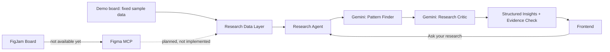

# FigJam Research Agent (experimental branch: `figmaconnecttry`)

## 1. What was built

An experimental extension of the standalone ResearchMate webapp (`webapp/`)
that connects a FigJam research board to a Gemini-backed research agent:
retrieve, normalize, analyze (Gemini), critique (a second Gemini pass), and
present structured, evidence-linked results in a new frontend page, with a
follow-up question and answer interface grounded in the same board.

This is scoped as an MVP proof of the pipeline shape, not a production
integration. It reuses the existing project's architecture (Flask backend,
pluggable `llm_providers.py`, plain HTML/CSS/JS frontend) rather than
introducing a new stack.

## 2. Honesty about the MCP integration: what actually works

**No live Figma/FigJam MCP tool is available in this environment.** Before
writing any code, the available tool catalog was searched for Figma/FigJam
tooling. The only related entry found was an unauthenticated `claude.ai
Figma` connector, listed as requiring OAuth before any of its tools become
visible. No callable tool (authorized or not) exists to read FigJam board
content (sticky notes, sections, groups) in this session.

Because this session is non-interactive, the OAuth flow for that connector
cannot be run here even if it were the right tool for the job. It's also not
confirmed that connector exposes FigJam-specific node content (sticky
notes, sections) versus general Figma design-file access, since its tool
schema was never loaded.

**What this means concretely:**
- `figjam/adapter.py` defines a real `FigJamAdapter` interface and a
  `MCPFigJamAdapter` implementation. `MCPFigJamAdapter.is_available()`
  returns `False`, and calling `fetch_board()` raises a `FigJamUnavailableError`
  with the explanation above; it is a real, empty-handed interface, not a
  fake success path.
- A `DemoFigJamAdapter` provides a fixed sample research board (15 items
  across 3 sections: Study Space, Wayfinding, Booking & Group Rooms) so the
  rest of the pipeline, retrieval through normalization, Gemini analysis,
  the critic pass, evidence verification, and the frontend, can be
  exercised end to end. Every place demo data surfaces in the UI is labeled
  as demo data (the connect banner, the board name itself).
- `get_adapter()` in `adapter.py` is the single place to swap in a real MCP
  tool later: once one is authorized and exposed, implement its call inside
  `MCPFigJamAdapter.fetch_board()`, mapping its response into the same
  `{"board_name": str, "raw_items": [...]}` shape `DemoFigJamAdapter`
  already produces, and `get_adapter()` will prefer it automatically
  (it checks `mcp_adapter.is_available()` first).

**Gemini reasoning is real, not simulated.** The two-stage Gemini pipeline
(Pattern Finder, then Research Critic) is fully implemented against the
project's existing pluggable `llm_providers.py` (Anthropic / OpenAI / Gemini
/ offline mock). It was verified with a real Gemini API call during this
build (see "What was tested" below) before the free-tier daily quota ran out
from testing. It is the FigJam *board retrieval* that is simulated via demo
data, not the AI reasoning on top of it.

## 3. Architecture



Code = deterministic data operations: retrieving raw items, normalizing them
into typed `ResearchItem`s, counting, grouping by section, and verifying
that every evidence ID Gemini cites actually exists in the retrieved board
(if not, the claim is dropped down to "unsupported" in code, not trusted
from the model).

Gemini = reasoning only: synthesizing themes/insights/contradictions/gaps/
opportunities (Pattern Finder), then challenging those insights for
evidence strength, overgeneralization, and contradictions (Research
Critic), and answering researcher questions grounded in the board.

## 4. Files added

```
webapp/backend/figjam/
  __init__.py
  models.py           ResearchItem, FigJamResearchContext (dataclasses)
  adapter.py           FigJamAdapter interface, MCPFigJamAdapter (unavailable),
                        DemoFigJamAdapter (sample board), get_adapter()
  normalize.py          raw board -> FigJamResearchContext (deterministic)
  research_agent.py     connect_board(), analyze_research(), ask_question()
                        (Gemini calls + evidence verification + activity log)
webapp/backend/test_figjam.py   standalone checks, run with `python test_figjam.py`
webapp/frontend/figjam.html     Connect FigJam / Agent Activity / Overview /
                                 Results / Ask your research page
webapp/frontend/figjam.css      page-specific styles (verdict badges, activity
                                 checklist, ask transcript)
webapp/frontend/figjam.js       wires the above to the API endpoints below
```

Modified: `webapp/backend/app.py` (new routes below), `webapp/backend/llm_providers.py`
(MockProvider now branches by system-prompt marker so FigJam gets its own
canned demo response instead of the Pattern Analyzer's), `webapp/frontend/index.html`
(one added nav link to `/figjam`, no other changes to the existing page).

## 5. New backend routes

- `GET /figjam`: serves the new frontend page.
- `POST /api/figjam/connect`: retrieves + normalizes the (demo) board, stores
  it in-memory for the session, returns overview counts, the activity log,
  and `is_demo: true`.
- `POST /api/figjam/analyze`: runs Pattern Finder then Research Critic on the
  connected board, verifies every cited evidence ID actually exists in the
  board, returns themes/insights/contradictions/research_gaps/design_opportunities
  plus the running activity log. Requires a prior `/connect` call (400 if not).
- `POST /api/figjam/ask` `{ "question": "..." }`: answers grounded only in the
  connected board and prior findings; marks `grounded: false` if it can't
  find support rather than guessing. Requires a prior `/connect` call.

State is in-memory, single-session, matching the existing Pattern Analyzer
page's approach (no database introduced for this MVP).

## 6. How Gemini is used

Two distinct system prompts, both going through the existing
`llm_providers.get_provider()` abstraction (so this works with Anthropic or
OpenAI too, not only Gemini, by changing `LLM_PROVIDER` in `.env`):

1. **Pattern Finder** (`ANALYZE_SYSTEM_PROMPT` in `research_agent.py`): given
   every research item with its stable id, produce themes, insights,
   contradictions, research gaps, and design opportunities, each citing the
   exact item ids it's based on.
2. **Research Critic** (`CRITIC_SYSTEM_PROMPT`): given the same items plus the
   candidate insights, independently judges each insight as `validated`,
   `weak`, or `contradictory`, with a specific note.

After both calls, application code (`_verify_evidence`) drops any cited id
that doesn't actually exist in the retrieved board and marks that claim
`unsupported: true` (surfaced in the UI as "Unsupported / needs
verification"), so Gemini cannot silently invent evidence.

## 7. How to run it

```bash
cd webapp/backend
pip install -r requirements.txt   # google-generativeai already included
python app.py
```

Open `http://localhost:5000/figjam`. Click **Connect / Select FigJam**
(connects the demo board, since no MCP source is available), then
**Analyze with Gemini**. Ask follow-up questions in **Ask your research**
once analysis has run.

Configure the LLM provider via the repo root `.env` (`LLM_PROVIDER=gemini|
anthropic|openai|mock`), same as the rest of the webapp.

## 8. What was tested

- `python webapp/backend/test_figjam.py`: 7 checks, all passing. Covers
  normalization of a typical board, an unsupported FigJam node type falling
  back to `"unknown"` instead of crashing, an empty board being rejected,
  the demo adapter connecting successfully, `MCPFigJamAdapter` failing
  honestly with a clear message, malformed/fenced JSON parsing, and evidence
  verification dropping invented ids.
- Ran the pipeline directly against a live Gemini call (bypassing Flask) during
  this build: connect succeeded; the analyze call hit a real `429
  ResourceExhausted` (free-tier daily quota of 20 requests, already spent on
  earlier testing in this session) and surfaced a clean, specific error
  instead of hanging or crashing.
- Ran the full HTTP pipeline (`/api/figjam/connect` -> `/api/figjam/analyze`
  -> `/api/figjam/ask`) against the offline mock provider, with real evidence
  ids from the demo board, correct verdict merging, and a grounded answer
  citing real item ids.
- Verified the empty-question validation path (`{"question": ""}` -> 400).
- Verified `GET /figjam`, `GET /api/provider` after the change.

## 9. What currently works

- Retrieve (demo data) -> normalize -> analyze -> critique -> evidence
  verification -> structured frontend display -> grounded Q&A, end to end.
- Evidence is real and traceable: every displayed theme/insight/contradiction
  shows the exact demo-board item ids backing it, and unsupported claims are
  labeled rather than hidden.
- Agent Activity panel reflects real pipeline steps (not animated placeholders):
  it's built from the same `activity` list the backend actually appended to
  during the request.
- Approve / Edit / Challenge / Reject controls on insights (frontend-only
  state, per the task's guidance that this can stay local for now).

## 10. What does not work / limitations

- **No real FigJam board can be connected.** Every "Connect FigJam" click
  loads the same fixed demo board. This is the single biggest gap and is
  documented, not hidden, in the UI banner and the connect response
  (`is_demo: true`).
- The Gemini free-tier API key used during this build hit its daily request
  quota (20/day) partway through testing, so live (non-mock) verification of
  `/api/figjam/analyze` and `/api/figjam/ask` end-to-end over HTTP could not
  be completed in this session; it was verified with a real Gemini call
  directly against the pipeline function (see above) before the quota ran
  out, and separately verified fully over HTTP with the mock provider.
- No automated test hits the actual Flask routes (only the underlying
  pipeline functions are unit-tested); route-level testing was done manually
  via HTTP calls during the session instead of as a checked-in test.
- `google-generativeai` (used by the existing `GeminiProvider`) is marked
  deprecated upstream in favor of `google-genai`; not migrated here since
  it's shared with the already-working Pattern Analyzer page and migrating
  it was out of scope for this experimental branch.

## 11. Future improvements

- Implement `MCPFigJamAdapter.fetch_board()` for real once a Figma/FigJam MCP
  tool is authorized and its schema is known, mapping its node output into
  the same `raw_items` shape used by `DemoFigJamAdapter`.
- Persist researcher decisions (approve/edit/challenge/reject) server-side
  instead of only in frontend state, so they survive a page reload.
- Migrate `GeminiProvider` off the deprecated `google-generativeai` package.
- Add a route-level test (e.g. using Flask's test client) instead of relying
  on manual HTTP verification during development.
