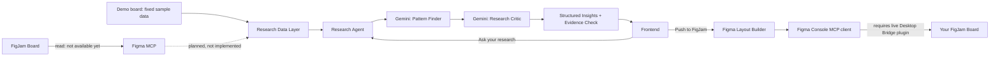

# FigJam Research Agent (experimental branch: `figmaconnecttry`)

## 1. What was built

An experimental extension of the standalone ResearchMate webapp (`webapp/`)
that connects a FigJam research board to a Gemini-backed research agent:
retrieve, normalize, analyze (Gemini), critique (a second Gemini pass), and
present structured, evidence-linked results in a new frontend page, with a
follow-up question and answer interface grounded in the same board.

This is scoped as an MVP proof of the pipeline shape, not a production
integration. It reuses the existing project's architecture (Flask backend,
pluggable `llm_providers.py`, plain HTML/CSS/JS frontend) rather than
introducing a new stack.

## 2. Honesty about the MCP integration: what actually works

**No live Figma/FigJam MCP tool is available in this environment.** Before
writing any code, the available tool catalog was searched for Figma/FigJam
tooling. The only related entry found was an unauthenticated `claude.ai
Figma` connector, listed as requiring OAuth before any of its tools become
visible. No callable tool (authorized or not) exists to read FigJam board
content (sticky notes, sections, groups) in this session.

Because this session is non-interactive, the OAuth flow for that connector
cannot be run here even if it were the right tool for the job. It's also not
confirmed that connector exposes FigJam-specific node content (sticky
notes, sections) versus general Figma design-file access, since its tool
schema was never loaded.

**What this means concretely:**
- `figjam/adapter.py` defines a real `FigJamAdapter` interface and a
  `MCPFigJamAdapter` implementation. `MCPFigJamAdapter.is_available()`
  returns `False`, and calling `fetch_board()` raises a `FigJamUnavailableError`
  with the explanation above; it is a real, empty-handed interface, not a
  fake success path.
- A `DemoFigJamAdapter` provides a fixed sample research board (15 items
  across 3 sections: Study Space, Wayfinding, Booking & Group Rooms) so the
  rest of the pipeline, retrieval through normalization, Gemini analysis,
  the critic pass, evidence verification, and the frontend, can be
  exercised end to end. Every place demo data surfaces in the UI is labeled
  as demo data (the connect banner, the board name itself).
- `get_adapter()` in `adapter.py` is the single place to swap in a real MCP
  tool later: once one is authorized and exposed, implement its call inside
  `MCPFigJamAdapter.fetch_board()`, mapping its response into the same
  `{"board_name": str, "raw_items": [...]}` shape `DemoFigJamAdapter`
  already produces, and `get_adapter()` will prefer it automatically
  (it checks `mcp_adapter.is_available()` first).

**Gemini reasoning is real, not simulated.** The two-stage Gemini pipeline
(Pattern Finder, then Research Critic) is fully implemented against the
project's existing pluggable `llm_providers.py` (Anthropic / OpenAI / Gemini
/ offline mock). It was verified with a real Gemini API call during this
build (see "What was tested" below) before the free-tier daily quota ran out
from testing. It is the FigJam *board retrieval* that is simulated via demo
data, not the AI reasoning on top of it.

## 3. Architecture



Code = deterministic data operations: retrieving raw items, normalizing them
into typed `ResearchItem`s, counting, grouping by section, and verifying
that every evidence ID Gemini cites actually exists in the retrieved board
(if not, the claim is dropped down to "unsupported" in code, not trusted
from the model).

Gemini = reasoning only: synthesizing themes/insights/contradictions/gaps/
opportunities (Pattern Finder), then challenging those insights for
evidence strength, overgeneralization, and contradictions (Research
Critic), and answering researcher questions grounded in the board.

## 4. Files added

```
webapp/backend/figjam/
  __init__.py
  models.py           ResearchItem, FigJamResearchContext (dataclasses)
  adapter.py           FigJamAdapter interface, MCPFigJamAdapter (unavailable),
                        DemoFigJamAdapter (sample board), get_adapter()
  normalize.py          raw board -> FigJamResearchContext (deterministic)
  research_agent.py     connect_board(), analyze_research(), ask_question()
                        (Gemini calls + evidence verification + activity log)
  figma_mcp_client.py    real MCP client for Figma Console MCP (write path):
                        create_section(), create_stickies(), list_tools()
  figma_layout.py        deterministic analysis-output -> FigJam layout plan,
                        push_layout_to_figjam()
webapp/backend/test_figjam.py   standalone checks, run with `python test_figjam.py`
webapp/frontend/figjam.html     Connect FigJam / Agent Activity / Overview /
                                 Results / Ask your research page
webapp/frontend/figjam.css      page-specific styles (verdict badges, activity
                                 checklist, ask transcript)
webapp/frontend/figjam.js       wires the above to the API endpoints below
webapp/figma-plugin/            Desktop Bridge plugin (manifest.json, code.js,
                                 ui.html), vendored from figma-console-mcp
                                 1.40.0 so it can be imported straight from
                                 this repo (see section 7)
```

Modified: `webapp/backend/app.py` (new routes below), `webapp/backend/llm_providers.py`
(MockProvider now branches by system-prompt marker so FigJam gets its own
canned demo response instead of the Pattern Analyzer's), `webapp/frontend/index.html`
(one added nav link to `/figjam`, no other changes to the existing page),
`webapp/backend/requirements.txt` and `webapp/.env.example` (added the `mcp`
Python SDK and `FIGMA_ACCESS_TOKEN` for the Push to FigJam feature),
`webapp/frontend/figjam.html` / `figjam.js` (added the Push to FigJam button).

## 5. New backend routes

- `GET /figjam`: serves the new frontend page.
- `POST /api/figjam/connect`: retrieves + normalizes the (demo) board, stores
  it in-memory for the session, returns overview counts, the activity log,
  and `is_demo: true`.
- `POST /api/figjam/analyze`: runs Pattern Finder then Research Critic on the
  connected board, verifies every cited evidence ID actually exists in the
  board, returns themes/insights/contradictions/research_gaps/design_opportunities
  plus the running activity log. Requires a prior `/connect` call (400 if not).
- `POST /api/figjam/ask` `{ "question": "..." }`: answers grounded only in the
  connected board and prior findings; marks `grounded: false` if it can't
  find support rather than guessing. Requires a prior `/connect` call.
- `POST /api/figjam/push-to-figjam`: pushes the current analysis to a real
  FigJam board as sections + sticky notes via Figma Console MCP (section 7).
  Requires a prior `/analyze` call (400 if not), and Figma Desktop + the
  Desktop Bridge plugin running (502 with a clear message if not reachable).

State is in-memory, single-session, matching the existing Pattern Analyzer
page's approach (no database introduced for this MVP).

## 6. How Gemini is used

Two distinct system prompts, both going through the existing
`llm_providers.get_provider()` abstraction (so this works with Anthropic or
OpenAI too, not only Gemini, by changing `LLM_PROVIDER` in `.env`):

1. **Pattern Finder** (`ANALYZE_SYSTEM_PROMPT` in `research_agent.py`): given
   every research item with its stable id, produce themes, insights,
   contradictions, research gaps, and design opportunities, each citing the
   exact item ids it's based on.
2. **Research Critic** (`CRITIC_SYSTEM_PROMPT`): given the same items plus the
   candidate insights, independently judges each insight as `validated`,
   `weak`, or `contradictory`, with a specific note.

After both calls, application code (`_verify_evidence`) drops any cited id
that doesn't actually exist in the retrieved board and marks that claim
`unsupported: true` (surfaced in the UI as "Unsupported / needs
verification"), so Gemini cannot silently invent evidence.

## 7. Writing output back to FigJam ("Push to FigJam")

This is a separate capability from board *reading* (section 2 above), added
after research corrected an earlier assumption in this document: a
write-capable Figma MCP integration for FigJam does exist today, via a
community project called **Figma Console MCP**
(https://github.com/southleft/figma-console-mcp), which exposes tools
including `figjam_create_section`, `figjam_create_sticky`,
`figjam_create_stickies` (batch, up to 200), `figjam_auto_arrange`, and more.
(Figma's own *official* remote MCP server at `mcp.figma.com` also exists, but
only allowlists specific IDE clients like Claude Code/Cursor/VS Code; a
custom backend cannot connect to it without joining Figma's developer
waitlist, so it isn't used here.)

**The hard constraint that can't be worked around:** Figma Console MCP does
not write to FigJam headlessly via just an API token. It relays tool calls to
a "Desktop Bridge" plugin that must be running *live* inside the Figma
Desktop app, with the target FigJam board open. There is no way to push
content to a board while Figma Desktop is closed. This is a real limitation
of Figma's plugin sandboxing model, not a shortcut taken in this build.

### What was built

- `webapp/backend/figjam/figma_mcp_client.py`: a real MCP stdio client (using
  the official `mcp` Python SDK) that spawns `npx -y figma-console-mcp@1.40.0`
  (version-pinned, see below) as a subprocess and calls its tools:
  `create_section`, `create_stickies`, `list_tools` (a connectivity check that
  doesn't require the bridge). One `session()` is now shared across an entire
  push operation rather than reopened per tool call, so a connected plugin
  stays paired with the same server instance for the whole push instead of
  reconnecting after every single sticky/section.
- `webapp/figma-plugin/` (`manifest.json`, `code.js`, `ui.html`): the Desktop
  Bridge plugin, checked into the repo (copied from a running `1.40.0`
  server's auto-generated files) so it can be imported into Figma Desktop
  directly from a repo-relative path instead of a hidden per-machine folder.
  Pinned to the same `1.40.0` version as the server on purpose: using
  `@latest` for the server while the plugin is a frozen copy would risk them
  silently drifting apart over time. If the plugin is ever re-copied from a
  newer server run, bump `_SERVER_PACKAGE` in `figma_mcp_client.py` to match.
- `webapp/backend/figjam/figma_layout.py`: deterministic (non-LLM) layout
  logic that turns the FigJam agent's analysis output into one real FigJam
  **section** per group (Themes, Insights, Contradictions, Research Gaps,
  Design Opportunities), each containing a grid of real sticky notes colored
  by group, positioned with simple column/row math.
- `POST /api/figjam/push-to-figjam` in `app.py`: runs the layout against
  whatever analysis is currently in memory, returns a summary (sections
  created, sticky count) or a clear error if the board/bridge isn't reachable.
- A **Push to FigJam** button on the results page, with the setup
  requirements stated directly in the UI, not hidden in docs only.

### Setup required (all on your machine, none of this can be automated remotely)

1. Install Node.js (required so the backend can run `npx`).
2. Get a Figma personal access token (Settings > Security > Personal access
   tokens), starts with `figd_`. Set `FIGMA_ACCESS_TOKEN=figd_...` in the repo
   root `.env`.
3. Open Figma Desktop, open the target FigJam board.
4. **Plugins > Development > Import plugin from manifest...**, select
   `webapp/figma-plugin/manifest.json` from this repo (one-time import; skip
   if already imported).
5. **Plugins > Development > Figma Desktop Bridge**, launch it. It connects
   automatically; no extra config.
6. Click **Push to FigJam** in the webapp while all of the above stays open.

### What was actually tested (and what wasn't)

- **Tested and confirmed working:** the MCP client genuinely spawns
  `figma-console-mcp`, completes the real MCP `initialize` handshake, and
  lists all 121 real tools it registers, including `figjam_create_section`
  and `figjam_create_stickies` (confirmed live, not from documentation alone;
  the docs actually undersold this - they didn't mention
  `figjam_create_section` existed at all, its exact JSON schema was pulled
  directly from the running server instead of trusted from docs).
- **Tested and confirmed working:** the full HTTP path, `POST
  /api/figjam/push-to-figjam` with a populated (mock-provider) analysis in
  memory, correctly builds a layout, attempts the real tool calls, and (since
  no Figma Desktop/Bridge was available in this environment to test against)
  fails with a clear, specific error rather than crashing, hanging, or
  silently "succeeding" with nothing created.
- **Not tested: an actual sticky note or section appearing on a real FigJam
  board.** This build environment has no GUI and cannot run Figma Desktop or
  click through its plugin menu, so the one thing that can't be verified from
  here is the final visual result. That step needs to happen on your machine,
  following the setup steps above.

### Known simplification

`figma_layout.py` positions stickies with fixed column/row math rather than
calling `figjam_auto_arrange`, because the batch `figjam_create_stickies`
tool's return value (whether it includes per-sticky node ids usable by
`auto_arrange`) wasn't confirmed live. The manual grid math achieves the same
visual result without depending on an unverified return shape.

## 8. How to run it

```bash
cd webapp/backend
pip install -r requirements.txt   # google-generativeai already included
python app.py
```

Open `http://localhost:5000/figjam`. Click **Connect / Select FigJam**
(connects the demo board, since no MCP source is available), then
**Analyze with Gemini**. Ask follow-up questions in **Ask your research**
once analysis has run.

Configure the LLM provider via the repo root `.env` (`LLM_PROVIDER=gemini|
anthropic|openai|mock`), same as the rest of the webapp.

To also use **Push to FigJam** (section 7): install Node.js, set
`FIGMA_ACCESS_TOKEN` in `.env`, and have Figma Desktop open with the target
board and the Desktop Bridge plugin running before clicking the button.

## 9. What was tested

- `python webapp/backend/test_figjam.py`: 7 checks, all passing. Covers
  normalization of a typical board, an unsupported FigJam node type falling
  back to `"unknown"` instead of crashing, an empty board being rejected,
  the demo adapter connecting successfully, `MCPFigJamAdapter` failing
  honestly with a clear message, malformed/fenced JSON parsing, and evidence
  verification dropping invented ids.
- Ran the pipeline directly against a live Gemini call (bypassing Flask) during
  this build: connect succeeded; the analyze call hit a real `429
  ResourceExhausted` (free-tier daily quota of 20 requests, already spent on
  earlier testing in this session) and surfaced a clean, specific error
  instead of hanging or crashing.
- Ran the full HTTP pipeline (`/api/figjam/connect` -> `/api/figjam/analyze`
  -> `/api/figjam/ask`) against the offline mock provider, with real evidence
  ids from the demo board, correct verdict merging, and a grounded answer
  citing real item ids.
- Verified the empty-question validation path (`{"question": ""}` -> 400).
- Verified `GET /figjam`, `GET /api/provider` after the change.
- Push to FigJam: see section 7's "What was actually tested" subsection for
  the write-path-specific tests (live MCP handshake, real tool list, full
  HTTP route, and the honest limitation on what couldn't be verified here).

## 10. What currently works

- Retrieve (demo data) -> normalize -> analyze -> critique -> evidence
  verification -> structured frontend display -> grounded Q&A, end to end.
- Evidence is real and traceable: every displayed theme/insight/contradiction
  shows the exact demo-board item ids backing it, and unsupported claims are
  labeled rather than hidden.
- Agent Activity panel reflects real pipeline steps (not animated placeholders):
  it's built from the same `activity` list the backend actually appended to
  during the request.
- Approve / Edit / Challenge / Reject controls on insights (frontend-only
  state, per the task's guidance that this can stay local for now).

## 11. What does not work / limitations

- **No real FigJam board can be connected.** Every "Connect FigJam" click
  loads the same fixed demo board. This is the single biggest gap and is
  documented, not hidden, in the UI banner and the connect response
  (`is_demo: true`).
- The Gemini free-tier API key used during this build hit its daily request
  quota (20/day) partway through testing, so live (non-mock) verification of
  `/api/figjam/analyze` and `/api/figjam/ask` end-to-end over HTTP could not
  be completed in this session; it was verified with a real Gemini call
  directly against the pipeline function (see above) before the quota ran
  out, and separately verified fully over HTTP with the mock provider.
- No automated test hits the actual Flask routes (only the underlying
  pipeline functions are unit-tested); route-level testing was done manually
  via HTTP calls during the session instead of as a checked-in test.
- `google-generativeai` (used by the existing `GeminiProvider`) is marked
  deprecated upstream in favor of `google-genai`; not migrated here since
  it's shared with the already-working Pattern Analyzer page and migrating
  it was out of scope for this experimental branch.
- **"Push to FigJam" cannot be verified end-to-end from this build
  environment.** The MCP client, subprocess spawn, handshake, and full HTTP
  route are all confirmed genuinely working (section 9), but the actual
  creation of a section/sticky on a real board requires Figma Desktop and the
  Desktop Bridge plugin running with a GUI, which isn't available here. This
  has to be verified on your own machine following the setup steps in
  section 7.
- No "section" grouping tool call was previously known to exist; this
  document originally (incorrectly) stated FigJam had no section-creation
  tool at all, based on incomplete third-party docs. That was corrected after
  querying the running server directly and finding `figjam_create_section` in
  its live tool list, which the layout code now uses.

## 12. Future improvements

- Implement `MCPFigJamAdapter.fetch_board()` for real once a Figma/FigJam MCP
  tool is authorized and its schema is known, mapping its node output into
  the same `raw_items` shape used by `DemoFigJamAdapter`.
- Persist researcher decisions (approve/edit/challenge/reject) server-side
  instead of only in frontend state, so they survive a page reload.
- Migrate `GeminiProvider` off the deprecated `google-generativeai` package.
- Add a route-level test (e.g. using Flask's test client) instead of relying
  on manual HTTP verification during development.
- Once `figjam_create_stickies`'s return shape is confirmed to include usable
  node ids, replace the manual grid math in `figma_layout.py` with a real
  `figjam_auto_arrange` call for tidier, tool-driven positioning.
- Investigate whether `MCPFigJamAdapter` (the read path, section 2) could
  also be implemented via Figma Console MCP's `figjam_get_board_contents`
  tool, now that this build has a working MCP client for that server. Not
  done in this build because the effort went into the write path per the
  user's request; the client code in `figma_mcp_client.py` could likely be
  extended with a `get_board_contents()` call using the same session pattern.
